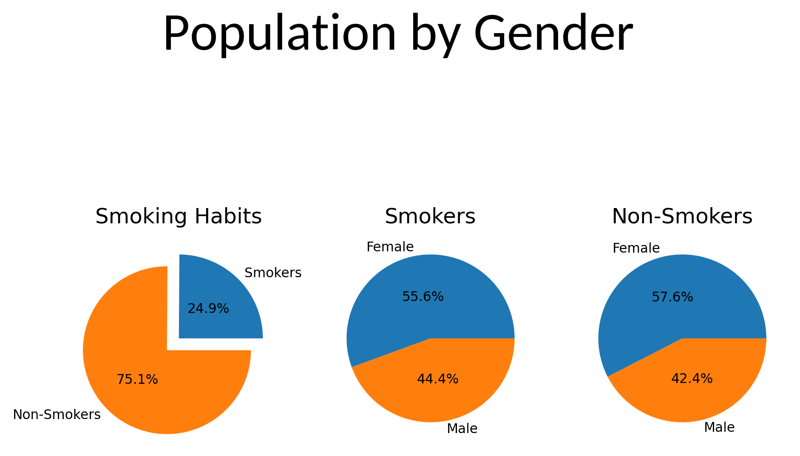
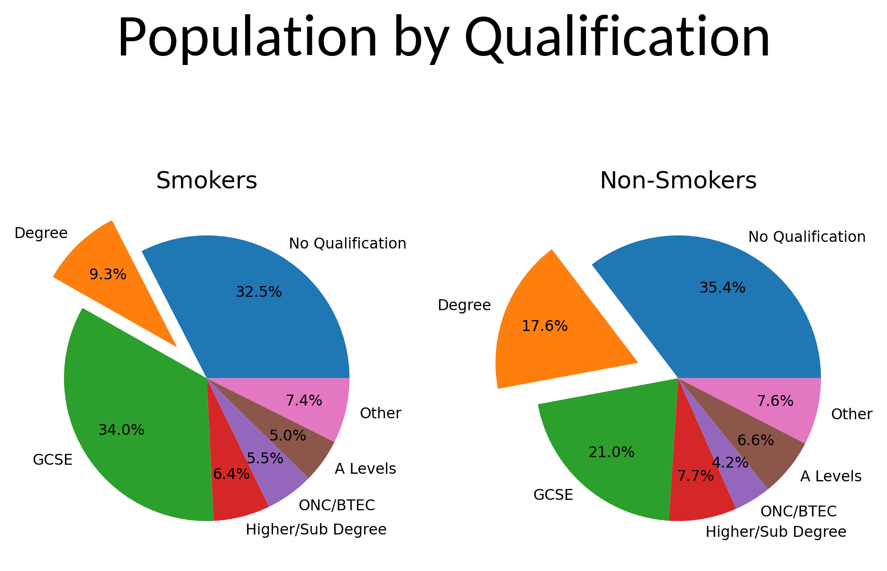
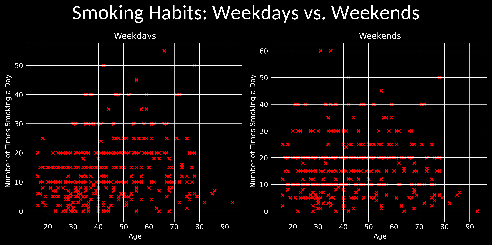
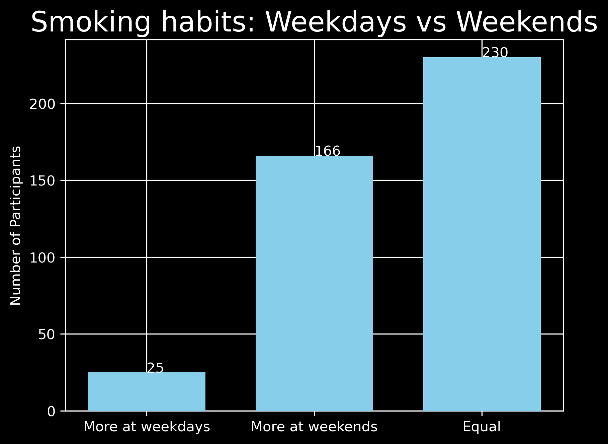

# py-stats
#### _A basic analysis of UK Smoking Stats_

This is a simple analysis of some statistics on a survey of UK nationals and their smoking habits.

- The .csv file with the raw data is found here: https://www.kaggle.com/datasets/utkarshx27/smoking-dataset-from-uk
- Only the 'smoking.csv' file is external. Everything else has been created by me.
- The source code contains a main.py file and the charts, which can be found in the charts/ directory.

## Analysis
#### _The Population_
The population contains a total of 1691 participants. They are split by smoking habits and gender as such:

Clearly, the most striking thing about this data is the fact that, despite this being a study on smoking habits, around *75%* of the participants do not smoke, meaning that conclusions drawn on the (comparatively) smaller population of smokers may not be as reliable as those drawn on non-smokers.
However, the split between gender, especially compared between smokers and non-smokers, is balenced. This makes the data a little more reliable when comparing the smokers and non-smokers by gender (but, it should still be noted, the number of - for example - female smokers is still much smaller than non-smokers, even if the percentages are more balanced).

We can also split both populations (smokers and non-smokers) by qualification. Doing so results in the following:

The only really significant difference is between the proportion of "Degrees" and "GCSEs" (which includes O Level and CSE), with nearly double the proportion of non-smokers having degrees. However, since the population of non-smokers is so much larger, this may simply be down to chance - a greater proportion of non-smokers, for example, have "No Qualification". So, displaying a relationship between qualifications and smoking habits using _this_ data is not possible.

#### _Smoking Habits_
Taking those who do smoke, we can plot their smoking habits verses their age by the number of times their smoke per day on weekends verses weekdays:

Again, there isn't a stark difference between the two, but we do get a couple of anomalies - namely, the two plots at 60 times smoking a day in their 30s during the weekend. The two participants in question, one male and the other female, smoke 40 and 30 times on weekdays respectively. This may display a trend to smoke more on weekends than on days, but calculating this based off two participants is unreasonable. Conversely, one participant - a male in his 60s, smokes 55 times a day on weekdays but only 5 times a day on weekends. This is such a large difference that it may be prudent to check the participant understood the question and was not providing the _total_ number of times smoked during weekdays (i.e., Monday to Friday).

To further analyse the habits of smokers during weekends verses weekdays, we can plot a simple bar chart which takes the those smoke more during _weekends_, those who smoke more during _weekdays_ and those who smoke an _equal_ number of times:

This displays some clearer trends. The majority of smokers do not change their smoking habits during the weekend or weekdays. However, of those who do, the vast majority smoke _more_ at the weekend than during the weekdays. This may be expected, due to "social" smoking during time off work (for those who work between Monday and Friday). However, we may expect the number of "weekend smokers" to be far higher - especially for those who may only smoke "socially" (i.e. with friends).

However, it may simply be that those who participated and do smoke a small number of times "socially" do not consider themselves smokers and therefore are listed until the "No" category under the "Smoke" column. These participants, of course, have no data regarding the number of times they smoke a day. 